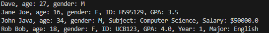
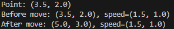
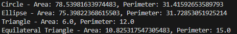
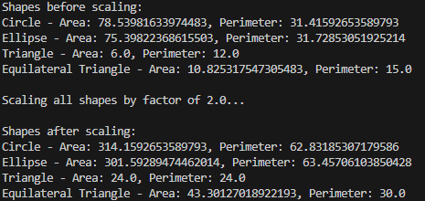

# Java QAP 3
## Cody Collins

### Problems Screenshots

### Feedback Questions
1. How many hours did it take you to complete this assessment? (Please keep try to keep track of how many hours you have spent working on each individual part of this assessment as best you can - an estimation is fine; we just want a rough idea.)
   
  A: it took me a total of roughly 8 hours
  
2. What online resources you have used? (My lectures, YouTube, Stack overflow etc.)
   
  A: I used the knowledge from your lectures as well as some help from chatgpt as a learning tool.

3. Did you need to ask any of your friends in solving the problems. (If yes, please mention name of the friend. They must be amongst your class fellows.)
   
  A: No
  
4. Did you need to ask questions to any of your instructors? If so, how many questions did you ask (or how many help sessions did you require)?
   
  A: No
  
5. Rate (subjectively) the difficulty of each question from your own perspective, and whether you feel confident that you can solve a similar but different problem requiring some of the same techniques in the future now that you’ve completed this one.
   
  A: I think each problem was somewhat challenging and a good way to implement the things we learned in class. Problem 3 was the most challenging for me personally (math is not my strong suit) 
